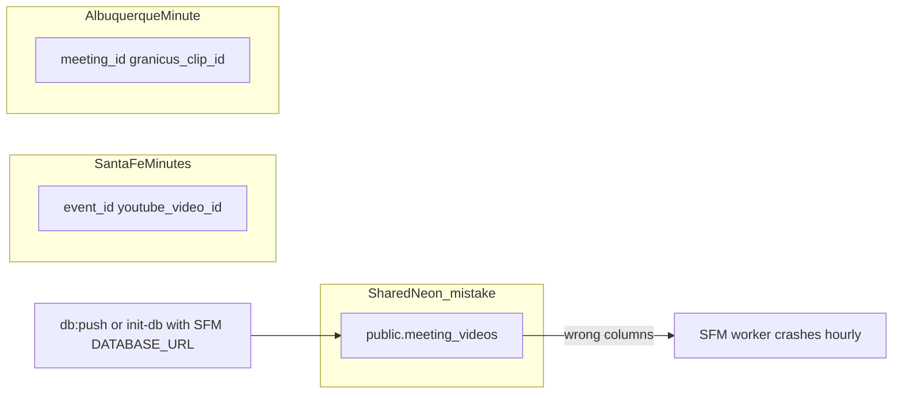

# Sep 2026: How ABQ pointed at Santa Fe’s database

**Audience:** Anyone working on Albuquerque Minute or Santa Fe Minutes who touches `DATABASE_URL`, schema scripts, or Neon.

**Last updated:** September 2026

---

## One-sentence summary

On the evening of **Sep 2, 2026**, while standing up Albuquerque Minute, a database setup command ran against **Santa Fe’s Neon** (`ep-ancient-cell`) instead of ABQ’s own project — replacing SFM’s `meeting_videos` table with ABQ’s Granicus-shaped schema and killing transcripts for ~19 hours.

---

## Timeline (git + VPS logs + chats)

| When (local, MDT) | What happened |
|---|---|
| **Sep 2, 5:29 PM** | ABQ repo created (`d7d148b`) — schema already defines `public.meeting_videos` with **`meeting_id`** (ABQ/Legistar shape), same table name as SFM |
| **Sep 2, 8:05 PM** | `7175acb` adds `scripts/init-db.ts` + `npm run db:init` / `db:push` — no guardrails yet |
| **Sep 2, ~9:00 PM** (~Sep 3 03:00 UTC) | SFM VPS worker **starts crashing every hour**: `column meeting_videos.event_id does not exist` — table is already wrong |
| **Sep 3, 10:57 AM** | `111db45` **commits explicit `DROP TABLE meeting_videos`** to init-db (“clean database state”) — makes the footgun worse |
| **Sep 3, 3:50 PM** | `12396ff` adds `meeting_transcripts` + more init-db DROP logic |
| **Sep 3, ~4 PM** | Missing QLC transcript noticed ([Sep 3 admin chat](https://cursor.com)) |
| **Sep 3, later** | Separate admin-status chat diagnoses wrong schema on **SFM Neon**: ABQ columns (`meeting_id`, `granicus_clip_id`), empty table, ABQ tables `meetings`/`meeting_files` also present → SFM `0046` repair applied |
| **Sep 3, ~10 PM** | QLC transcript recovered; canary hardening shipped (`3bf5a28`) |
| **Sep 4+** | ABQ gets **own Neon** on Vercel (`ep-blue-sky-*`); guards added to ABQ + SFM |

---

## What actually broke (mechanism)

Both apps use Postgres table name **`public.meeting_videos`**. Same name, incompatible design:

| | Santa Fe Minutes | Albuquerque Minute |
|---|---|---|
| **Links** | CivicClerk events + YouTube | Legistar meetings + Granicus clips |
| **Key columns** | `event_id`, `youtube_video_id` | `meeting_id`, `granicus_clip_id` |

**Not** “ABQ app calls Santa Fe in production.” **Yes** “someone ran ABQ database tooling while `DATABASE_URL` pointed at Santa Fe’s Neon.”

### Most likely trigger (Sep 2 ~9 PM)

We cannot prove the exact command from logs, but evidence fits **one of these** run from the ABQ repo with **Santa Fe’s URL** in env:

1. **`npm run db:push`** (Drizzle) — can drop/recreate tables when schema conflicts; ABQ schema has `meeting_id`, SFM has `event_id`
2. **`npm run db:init -- --apply`** after `111db45`-style DROP logic existed locally or was run uncommitted — script literally `DROP TABLE meeting_videos CASCADE`
3. **Less likely:** first `7175acb` init-db alone — that version only had `CREATE IF NOT EXISTS`, which would **not** replace an existing SFM table

**Supporting evidence from admin-status chat:**

- SFM Neon contained ABQ tables (`meetings`, `meeting_files`) **and** wrong `meeting_videos` (0 rows, ABQ columns)
- That pattern matches ABQ setup scripts running on SFM’s database, not ABQ’s

### Why `.env.example` wasn’t enough

ABQ [`.env.example`](../.env.example) line 1 already says “do not reuse Santa Fe Minutes DB” — but during fast scaffold on Sep 2, **`DATABASE_URL` in `.env.local` was almost certainly copied from SFM** (or both apps briefly shared one Neon project before ABQ’s Vercel Neon integration ~2 days later).

`.env.example` is documentation. **Nothing enforced it until Sep 4.**

---

## Why it stayed invisible for ~19 hours

- SFM worker **timer looked fine** — it ran hourly but **crashed** on missing `event_id`
- Monitoring **joined the same broken table** and threw silently (fixed later in `3bf5a28`)
- Outage was found on a **meeting page**, not from email/admin banner

---

## What we fixed after

| Layer | Fix |
|---|---|
| **Isolation** | ABQ prod → `ep-blue-sky-*` / `empty-poetry-25203087`; SFM → `ep-ancient-cell-*` / `fancy-wildflower-24339791` (verified) |
| **SFM repair** | `drizzle/0046_repair_meeting_videos_schema.sql` + repair script; 836 video stub rows restored |
| **ABQ guards** | [`assert-not-sfm.ts`](../src/lib/db/assert-not-sfm.ts) on `getDb()`, `drizzle.config.ts`, `db:push`, `init-db.ts` (requires `--apply`) |
| **SFM guards** | `scripts/verify-database-isolation.ts`, `docs/database-isolation.md` in Santa Fe Minutes repo |
| **Monitoring** | Schema-mismatch + worker-tick-failed alerts; admin pipeline banner |

---

## Related docs

- **[database-safety.md](database-safety.md)** — operational rules for ABQ (read before any DB command)
- **Santa Fe Minutes:** `docs/database-isolation.md` — SFM-side verification and recovery
